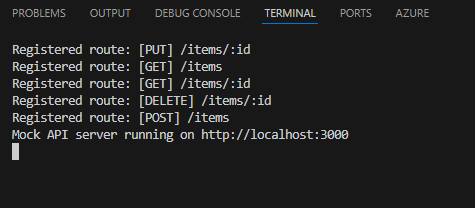

# CDK TypeScript Starter

This project is a boilerplate for deploying AWS CDK applications in TypeScript with support for local development and testing using Express and Docker-based DynamoDB.
For DynamoDB we're using the single-table design.


---

## Table of Contents

- [Overview](#cdk-typescript-starter)
- [Useful Commands](#useful-commands)
- [Setting Up Local DynamoDB](#setting-up-local-dynamodb)
- [Enabling Local Testing](#enabling-local-testing)
- [Starting the Local Server](#starting-the-local-server)
- [Code Examples](#code-examples)
- [License](#license)

---

## Useful Commands

- `npm run build` – Compile TypeScript to JavaScript  
- `npm run watch` – Watch for changes and compile  
- `npm run test` – Run Jest unit tests  
- `npx cdk deploy` – Deploy the stack to your AWS account/region  
- `npx cdk diff` – Compare deployed stack with current state  
- `npx cdk synth` – Generate the CloudFormation template  

---

## Setting Up Local DynamoDB

1. **Run a local DynamoDB container:**
   ```bash
   docker run -d -p 8000:8000 --name dynamodb-local amazon/dynamodb-local
   ```

2. **Start the container:**
   ```bash
   docker start dynamodb-local
   ```

3. **Stop the container:**
   ```bash
   docker stop dynamodb-local
   ```

4. **Create a table:**
   ```bash
   aws dynamodb create-table \
     --cli-input-json file://testing/dynamodb.table-config.json \
     --endpoint-url http://localhost:8000
   ```

5. **Verify the table:**
   ```bash
   aws dynamodb list-tables --endpoint-url http://localhost:8000
   ```

---

## Enabling Local Testing

Install the required dev dependencies:

```bash
npm install --save-dev express @types/express reflect-metadata dotenv glob@^9
```

- `express` – Lightweight Node.js web framework  
- `@types/express` - Adds the declaration file for express.
- `reflect-metadata` – Enables decorators
- `dotenv` – Loads environment variables
- `glob@^9` – Loads all controller files. The latest version (11 at the time of documenting) causes compile issues.

Create a `testing` folder and add the following files to it:

1. `.env` – Environment variables
2. `decorators.ts` – Decorators and controller registry
3. `server.ts` – Express server setup

---

## Starting the Local Server

Run the following in your console:

```bash
clear | npm run build:local | node dist/testing/server
```

Make sure your `package.json` includes:

```json
"scripts": {
  "build:local": "(if exist dist rmdir /s /q dist) && tsc",
  "build": "tsc"
}
```

---

## Successful Running Example



---

## Code Examples

### `.env`

```dotenv
TABLE_NAME=dev-data
REGION=eu-west-1
IS_LOCAL=true
```

---

### `decorators.ts`

```ts
import 'reflect-metadata';

type HttpMethod = 'GET' | 'POST' | 'PUT' | 'PATCH' | 'DELETE';

function createRoute(route: string) {
  return function (method: HttpMethod) {
    return function (target: any, propertyKey: string) {
      Reflect.defineMetadata('method', method, target, propertyKey);
      Reflect.defineMetadata('route', route, target, propertyKey);
    };
  };
}

export const Get = (route: string) => createRoute(route)('GET');
export const Post = (route: string) => createRoute(route)('POST');
export const Put = (route: string) => createRoute(route)('PUT');
export const Patch = (route: string) => createRoute(route)('PATCH');
export const Delete = (route: string) => createRoute(route)('DELETE');

export const controllers: Function[] = [];
export const Controller = (basePath: string): ClassDecorator => {
  return (target) => {
    Reflect.defineMetadata('basePath', basePath, target);
    controllers.push(target);
  };
};
```

---

### `server.ts`

```ts
import 'reflect-metadata';
import express from 'express';
import path from 'path';
import dotenv from 'dotenv';
import { globSync } from 'glob';

dotenv.config({
  path: path.resolve(__dirname, '..', '..', 'testing', '.env')
});

globSync('../lib/stacks/lambda/code/**/*.js', { cwd: __dirname }).forEach(f =>
  require(path.join(__dirname, f))
);

import { controllers } from './decorators';

const app = express();
app.use(express.json());

const routes: string[] = [];

controllers.forEach((controller: any) => {
  const instance = new controller();
  const ctor = instance.constructor;
  const base = Reflect.getMetadata('basePath', ctor) || '';
  const prototype = Object.getPrototypeOf(instance);
  const methodNames = Object.getOwnPropertyNames(prototype).filter(name => name !== 'constructor');

  methodNames.forEach(methodName => {
    const route = Reflect.getMetadata('route', prototype, methodName);
    const httpMethod = Reflect.getMetadata('method', prototype, methodName)?.toLowerCase();
    const fullPath = `/${[base, route].filter(Boolean).join('/')}`;

    const routeId = `[${httpMethod?.toUpperCase()}] ${fullPath}`;
    if (routes.includes(routeId)) throw new Error(`Duplicate Route: ${routeId}`);
    routes.push(routeId);

    app[httpMethod](fullPath, async (req, res) => {
      try {
        req.pathParameters = req.params;
        const result = await instance[methodName](req);
        res.status(result.statusCode || 200).json(result.body || {});
      } catch (e: any) {
        res.status(500).json({ error: e.message });
      }
    });

    console.log(`Registered route: ${routeId}`);
  });
});

app.listen(3000, () => {
  console.log(`Mock API server running on http://localhost:3000`);
});
```

---

### `Controller`

```ts
import { Controller, Get } from "../../../../../testing/decorators";
import { buildResponseBody } from "../../helpers/lambda-response.helper";
import { IItem } from "../../interfaces/IItem";
import { IRequest } from "../../interfaces/IRequest";
import { DynamoDbService } from "../../services/dynamodb.service";

@Controller('items')
export class ItemsGetController {
	@Get(':id')
	async handler(request: IRequest) {
		try {
			console.log('Fetching Item.');
			const dynamoDbService = new DynamoDbService();
			const item = await dynamoDbService.get<IItem>(request.pathParameters.id, 'ITEM', 'ITEM');

			console.log('Done.');
			return buildResponseBody(200, item, 'ALLOW');
		} catch (error: any) {
			console.log(`Failed to get Item with ID ${request.pathParameters.id}:`, error);
			return buildResponseBody(500, error.message, 'ALLOW');
		}
	}
}

export const handler = async (request: IRequest) => {
	const controller = new ItemsGetController();
	return await controller.handler(request);
}
```

---

### `dynamodb.table-config.json`

```json
{
	"TableName": "dev-data",
	"BillingMode": "PAY_PER_REQUEST",
	"AttributeDefinitions": [
		{
			"AttributeName": "PK",
			"AttributeType": "S"
		},
		{
			"AttributeName": "SK",
			"AttributeType": "S"
		}
	],
	"KeySchema": [
		{
			"AttributeName": "PK",
			"KeyType": "HASH"
		},
		{
			"AttributeName": "SK",
			"KeyType": "RANGE"
		}
	],
	"GlobalSecondaryIndexes": [
		{
			"IndexName": "SK-PK-index",
			"KeySchema": [
				{
					"AttributeName": "SK",
					"KeyType": "HASH"
				},
				{
					"AttributeName": "PK",
					"KeyType": "RANGE"
				}
			],
			"Projection": {
				"ProjectionType": "ALL"
			}
		}
	]
}
```

---

### 🗺️ Project Diagram

````md
## Project Architecture

+-----------------------------+
|     Developer Machine       |
|                             |
|  ┌───────────────────────┐  |
|  |  Express Local Server |  |
|  |  (server.ts)          |  |
|  └───────────────────────┘  |
|           │                 |
|           ▼                 |
|  ┌───────────────────────┐  |
|  | Local DynamoDB (Docker)| |
|  └───────────────────────┘  |
+-----------------------------+

         ▲
         │
         │ CDK Deploy
         ▼

+-----------------------------+
|        AWS Cloud            |
|                             |
|  ┌───────────────────────┐  |
|  |   Lambda Function     |  |
|  |   (from lib/)         |  |
|  └───────────────────────┘  |
|           │                 |
|           ▼                 |
|  ┌───────────────────────┐  |
|  |     DynamoDB Table    |  |
|  └───────────────────────┘  |
+-----------------------------+

````

---

## License

MIT
